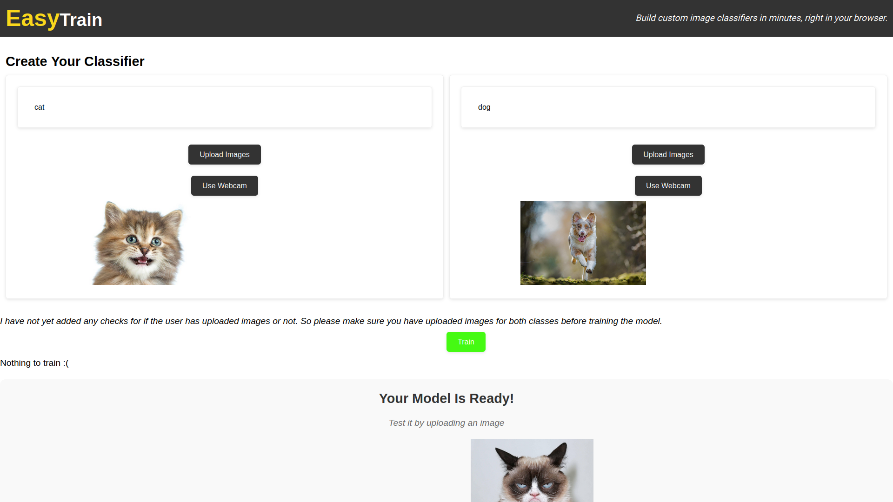

# EasyTrain

A user-friendly application for training custom image classification models directly in your browser without writing even a single line of code.

## Images

## Current Features

- Dataset Management: Upload, preview, and preprocess images for training and validation.
- Training and Evaluation: Configure hyperparameters, monitor training progress, and visualize results.
- Model Export: Download the trained model for deployment on edge devices or cloud platforms.

## Future Goals

- Different model architectures: Support a variety of pre-trained models (e.g., MobileNet, ResNet) and custom architectures.
- Cloud Integration: Provide optional pathways for deploying trained models to Google Cloud Platform, leveraging services like App Engine, Cloud Functions, and Cloud Storage for scalability and broader access.
- Enhanced UI: Create a more polished and intuitive user interface for dataset management, model customization, and visualization of results.
- Performance Optimization: Explore strategies to improve training efficiency, especially on resource-constrained devices.

## Contributions

This project welcomes contributions to accelerate its development and make it even more valuable for the community! Feel free to open issues for feature requests or bug reports, and submit pull requests for code improvements.
